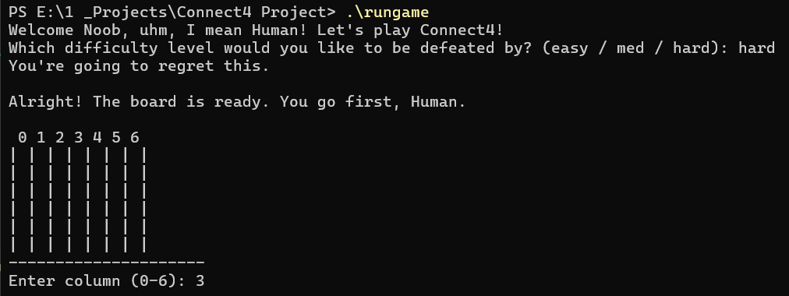
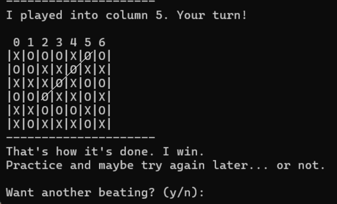

# Connect4 Game with an AI opponent

A modified implementation of the classic **Connect4** game, featuring an intelligent AI opponent built using the **Minimax** Algorithm with **Alpha-Beta Pruning** to select the ideal moves. This project is designed to simulate a competitive two-player grid-based game, with a strategic and performance-optimized computer player challenging the user in real-time.

## Project Overview

This project focuses on the algorithmic and decision-making engine behind the game of Connect4. It emphasizes on game-solving techniques used in artificial intelligence and simulates realistic game play, offering user a chance to play against a rather cocky AI.

Key goals included:
- Implementing the core **game mechanics** (board management, win detection, input handling)
- Developing an **AI agent** using the **Minimax search algorithm**, optimized through **Alpha-Beta pruning**
- Allowing **difficulty scaling** (easy/medium/hard) by varying the search depth
- Creating a user-engaging experience through first-person AI commentary and smart decision-making

Here's me losing to the hard mode on the last move:

## Features

### Game Engine
- Designed using **modular C++ classes**:
  - `GameBoard.cpp`: handles game state and win condition logic
  - `AIPlayer.cpp`: implements Minimax with Alpha-Beta pruning and evaluation heuristics
  - `HumanPlayer.cpp`: manages user input and move validation
    
### AI Opponent
- Uses **Minimax algorithm** to simulate future game states up to a configurable depth
- Integrates **Alpha-Beta Pruning** to improve efficiency and allow deeper searches
- Uses **dynamic board evaluation**, prioritizing center control and blocking opponent threats while building it's own using a well crafted board evaluation method.

- Evaluation function considers:
  - Offensive opportunities (e.g., 3-in-a-row setups)
  - Defensive requirements (e.g., blocking opponent's 3s)
  - Center column weighting for strategic positioning
    
- AI difficulty is selectable at runtime:
  - `easy` → depth 2
  - `med` → depth 4
  - `hard` → depth 6

### User Experience
- Interactive prompts and board display after each move
- AI communicates in a **first-person, slightly sarcastic tone**, enhancing immersion
- Clean prompts to replay or exit the game after a round

## How to Run

1. Compile using `g++`:
   g++ Connect4_AI_Opponent -o connect4

2. Run on terminal:
   .\connect4

Please explore the files to know more!
